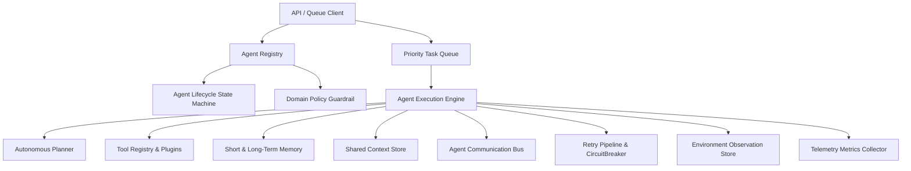

# Enterprise AI Agent Framework Manual

This document details the production-ready, provider-agnostic **Enterprise AI Agent Framework**.

> [!IMPORTANT]
> **Domain Policy Guardrails**:
> The agent framework contains zero hardcoded medical or insurance agents. All agent definitions, system prompts, goals, and tasks are dynamically screened by `DomainGuardrail`.

---

## 🏛️ System Topology & Architecture



---

## ⚡ Core Framework Components

1. **Agent Registry** ([`registry.py`](file:///home/aryan/Videos/IRE/backend/app/agents/registry.py))
   - Provider-agnostic agent registry tracking agent capabilities, roles, system prompts, primary model selection, and active state.

2. **Agent Lifecycle Manager** ([`lifecycle.py`](file:///home/aryan/Videos/IRE/backend/app/agents/lifecycle.py))
   - State machine managing valid state transitions: `INITIALIZED` $\rightarrow$ `IDLE` $\rightarrow$ `PLANNING` $\rightarrow$ `RUNNING` $\rightarrow$ `WAITING_FOR_INPUT` $\rightarrow$ `COMPLETED` / `FAILED` / `PAUSED` / `TERMINATED`.

3. **Tool Registry & Plug-and-Play Extension** ([`tool_registry.py`](file:///home/aryan/Videos/IRE/backend/app/agents/tool_registry.py))
   - `BaseAgentTool` abstract interface allowing developers to write custom tools without altering core framework code.
   - Built-in safe tools: `http_request`, `data_transform`, `math_solver`.

4. **Autonomous Planner** ([`planner.py`](file:///home/aryan/Videos/IRE/backend/app/agents/planner.py))
   - Powered by provider-independent `llm_gateway`. Decomposes complex goals into ordered step graphs (`ExecutionPlan`).

5. **Priority Task Queue** ([`task_queue.py`](file:///home/aryan/Videos/IRE/backend/app/agents/task_queue.py))
   - Priority task scheduling (`HIGH`, `MEDIUM`, `LOW`) with background execution workers.

6. **Agent Execution Engine** ([`execution_engine.py`](file:///home/aryan/Videos/IRE/backend/app/agents/execution_engine.py))
   - Coordinates planning, tool calling with timeouts and exponential retries, observation recording, memory updates, quality evaluations, and metrics logging.

7. **Shared Context & Memory** ([`memory.py`](file:///home/aryan/Videos/IRE/backend/app/agents/memory.py))
   - Multi-tenant shared context store (`SharedAgentMemory`) and conversation memory integration.

8. **Communication Bus** ([`communication.py`](file:///home/aryan/Videos/IRE/backend/app/agents/communication.py))
   - Direct agent-to-agent messaging and Pub/Sub event topic channels (`AgentCommunicationBus`).

9. **Observation Store & Telemetry Metrics** ([`observation_store.py`](file:///home/aryan/Videos/IRE/backend/app/agents/observation_store.py) & [`metrics.py`](file:///home/aryan/Videos/IRE/backend/app/agents/metrics.py))
   - Audits step-by-step perception logs (`EnvironmentObservation`) and tracks execution counts, duration, and tool usage frequencies.

---

## 🔌 API Endpoints Summary

| Endpoint | Method | Description |
| :--- | :--- | :--- |
| `/api/v1/agents/register` | `POST` | Register a new agent specification |
| `/api/v1/agents/` | `GET` | List registered agents and live status |
| `/api/v1/agents/run` | `POST` | Synchronously execute an agent goal |
| `/api/v1/agents/tasks/submit` | `POST` | Submit goal to Priority Task Queue |
| `/api/v1/agents/tasks/{task_id}` | `GET` | Get task status and execution output |
| `/api/v1/agents/tools` | `GET` | List registered agent tools |
| `/api/v1/agents/tools/register` | `POST` | Dynamically register a new agent tool |
| `/api/v1/agents/metrics/{agent_id}` | `GET` | Retrieve agent performance metrics |
| `/api/v1/agents/messages/send` | `POST` | Send message or publish to topic channel |
| `/api/v1/agents/messages/receive/{agent_id}` | `GET` | Retrieve unread agent inbox messages |
| `/api/v1/agents/shared-context` | `GET` | Retrieve tenant shared context KV store |

---

## 🧪 Verification & Unit Testing

```bash
cd /home/aryan/Videos/IRE/backend
python3 -m pytest tests/test_enterprise_agent_framework.py -v
```
