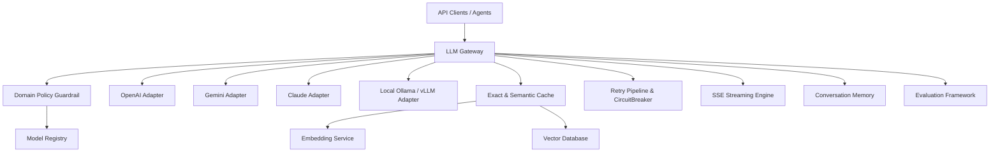

# Provider-Independent AI Infrastructure Architecture & Manual

This document details the production-ready **AI Infrastructure** framework.

> [!IMPORTANT]
> **Strict Domain Guardrails**:
> The infrastructure contains **ZERO medical prompts** and **ZERO insurance prompts**. All prompts, templates, user queries, and agent memories are automatically screened and validated by the `DomainGuardrail` module. Medical or insurance domain inputs are strictly rejected with a `DomainPolicyViolationException` (HTTP 400).

---

## 🏛️ Architecture Overview

The AI Infrastructure provides unified, provider-independent abstractions across 10 core pillars:



---

## ⚡ Core Infrastructure Components

### 1. LLM Gateway & Streaming
- **Provider Independence**: Seamlessly route inference to OpenAI (`gpt-4o`, `gpt-4o-mini`, `o1-mini`), Gemini (`gemini-1.5-pro`, `gemini-1.5-flash`, `gemini-2.0-flash`), Claude (`claude-3-5-sonnet`, `claude-3-haiku`), or Local models (`llama3:70b`, `mistral-large-vllm`).
- **Fallback Chains**: Automatic failover across provider candidate lists if primary models encounter rate limits or outages.
- **Streaming**: Server-Sent Events (SSE) streaming via `POST /api/v1/ai/stream` and async generators across all providers.

### 2. Prompt Registry
- **Versioning & Interpolation**: Register versioned templates (`generic_reasoning:1.0.0`, `json_extractor:1.0.0`) with variable placeholders.
- **Domain Guardrail Check**: Every template is screened during registration and rendering to ensure no medical or insurance domain rules are injected into prompt templates.

### 3. Model Registry
- Centralized model metadata registry tracking provider capabilities, context window lengths, vision/tool call support, streaming capabilities, and per-token cost estimation.

### 4. Embedding Service
- Multi-provider embedding service supporting OpenAI (`text-embedding-3`), Gemini (`text-embedding-004`), and Local HuggingFace embeddings (`SentenceTransformers`).
- Provides unified `embed_query()` and batch `embed_documents()`.

### 5. Vector Database
- Pluggable vector store interface (`IVectorStore`) with built-in `InMemoryVectorStore` supporting exact cosine similarity, dot product, L2 distance, multi-tenant isolation (`tenant_id`), and payload metadata filtering.

### 6. Conversation Memory
- Multi-tenant conversation memory supporting:
  - `SlidingWindowMemory`: Short-term turn window buffer.
  - `SummaryConversationMemory`: Compress long context into running summaries.
  - `VectorBackedLongTermMemory`: Index and semantically recall past interaction turns.

### 7. AI Caching
- Multi-tier caching featuring **Exact Hash Matching** (SHA-256) and **Semantic Caching** (Vector Similarity Search with threshold $\ge 0.92$).
- Includes cache hit/miss ratio telemetry and TTL expiration.

### 8. Retry Pipeline & Circuit Breaker
- Exponential backoff with full jitter for API resilience.
- Integrated `CircuitBreaker` (`CLOSED`, `OPEN`, `HALF_OPEN`) to prevent cascade failures.
- Filters non-retryable client errors and policy violations.

### 9. Evaluation Framework
- Provider-independent LLM evaluation testing:
  - **Faithfulness**: Context grounding overlap.
  - **Hallucination Safety**: Groundedness ratio ($1 - \text{hallucination\_rate}$).
  - **Relevance**: Query alignment score.
  - **Domain Compliance**: Strict verification of zero medical and zero insurance content.

---

## 🔌 API Endpoints Summary

| Endpoint | Method | Description |
| :--- | :--- | :--- |
| `/api/v1/ai/generate` | `POST` | Generate LLM text with caching, retry, and evaluation |
| `/api/v1/ai/stream` | `POST` | Server-Sent Events (SSE) streaming output |
| `/api/v1/ai/models` | `GET` | List registered models and capabilities |
| `/api/v1/ai/prompts` | `POST` / `GET` | Register and list versioned prompt templates |
| `/api/v1/ai/prompts/render` | `POST` | Render prompt template with variables |
| `/api/v1/ai/embeddings` | `POST` | Generate text embeddings |
| `/api/v1/ai/vector-db/upsert` | `POST` | Upsert records into Vector Database |
| `/api/v1/ai/vector-db/search` | `POST` | Search Vector Database by similarity |
| `/api/v1/ai/memory/turns` | `POST` | Append conversation memory turn |
| `/api/v1/ai/memory/{session_id}` | `GET` | Retrieve conversation history |
| `/api/v1/ai/cache/stats` | `GET` | Retrieve cache telemetry stats |
| `/api/v1/ai/cache/clear` | `POST` | Purge exact & semantic cache |
| `/api/v1/ai/evaluate` | `POST` | Run evaluation metrics on prompt & response |

---

## 🧪 Verification & Unit Testing

To execute the test suite:

```bash
cd backend
python3 -m pytest tests/test_ai_infrastructure.py -v
```
