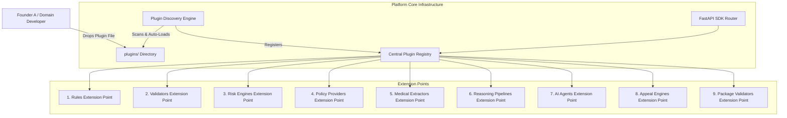

# Founder A Business Logic SDK Guide

This guide details how **Founder A** (or any domain engineer) can create custom business logic plugins using the **Business Logic SDK** without modifying a single line of backend platform infrastructure code.

> [!IMPORTANT]
> **Zero Infrastructure Edits**:
> Founder A NEVER edits backend platform code (gateway, database models, API routing, infrastructure loaders).
> Simply drop new Python plugin files into the `plugins/` directory. The platform automatically discovers, loads, and registers them at runtime.

---

## 🧩 Architecture Overview & Auto-Discovery Flow



---

## 🛠️ Step-by-Step Code Examples for All 9 Extension Points

Create a new file `plugins/my_custom_business_logic.py` and implement any of the following plugins:

### 1. Custom Rules Plugin (`@register_rule`)

```python
from typing import Dict, Any
from app.sdk import BaseRulePlugin, register_rule

@register_rule(plugin_id="rule_vip_client", name="VIP Client Processing Rule", version="1.0.0")
class VIPClientRulePlugin(BaseRulePlugin):
    async def initialize(self) -> bool:
        return True

    async def shutdown(self) -> None:
        pass

    async def evaluate_rule(self, context: Dict[str, Any]) -> Dict[str, Any]:
        client_tier = context.get("tier", "STANDARD")
        is_vip = client_tier == "VIP"
        return {
            "rule_id": self.metadata.plugin_id,
            "passed": is_vip,
            "priority": "HIGH" if is_vip else "NORMAL"
        }
```

### 2. Custom Validator Plugin (`@register_validator`)

```python
from typing import Dict, Any
from app.sdk import BaseValidatorPlugin, register_validator

@register_validator(plugin_id="val_strict_payload", name="Strict Payload Validator", version="1.0.0")
class StrictPayloadValidatorPlugin(BaseValidatorPlugin):
    async def initialize(self) -> bool:
        return True

    async def shutdown(self) -> None:
        pass

    async def validate_payload(self, data: Dict[str, Any]) -> Dict[str, Any]:
        required = ["tenant_id", "payload_type"]
        missing = [k for k in required if k not in data]
        return {
            "valid": len(missing) == 0,
            "missing_fields": missing
        }
```

### 3. Custom Risk Engine Plugin (`@register_risk_engine`)

```python
from typing import Dict, Any
from app.sdk import BaseRiskEnginePlugin, register_risk_engine

@register_risk_engine(plugin_id="risk_ops_default", name="Operations Risk Engine", version="1.0.0")
class OperationsRiskEnginePlugin(BaseRiskEnginePlugin):
    async def initialize(self) -> bool:
        return True

    async def shutdown(self) -> None:
        pass

    async def calculate_risk(self, entity_data: Dict[str, Any]) -> Dict[str, Any]:
        amount = float(entity_data.get("amount", 0.0))
        score = 0.90 if amount > 10000.0 else 0.10
        return {
            "risk_score": score,
            "high_risk": score >= 0.8,
            "risk_tier": "CRITICAL" if score >= 0.8 else "LOW"
        }
```

### 4. Custom Policy Provider Plugin (`@register_policy_provider`)

```python
from typing import Dict, Any
from app.sdk import BasePolicyProviderPlugin, register_policy_provider

@register_policy_provider(plugin_id="policy_enterprise_terms", name="Enterprise Terms Provider", version="1.0.0")
class EnterpriseTermsPolicyPlugin(BasePolicyProviderPlugin):
    async def initialize(self) -> bool:
        return True

    async def shutdown(self) -> None:
        pass

    async def fetch_policy(self, policy_id: str, context: Dict[str, Any]) -> Dict[str, Any]:
        return {
            "policy_id": policy_id,
            "compliance_status": "ACTIVE",
            "effective_date": "2026-01-01"
        }
```

### 5. Custom Medical Extractor Plugin (`@register_medical_extractor`)

```python
from typing import Dict, Any
from app.sdk import BaseMedicalExtractorPlugin, register_medical_extractor

@register_medical_extractor(plugin_id="med_clinical_coder", name="Clinical Entity Extractor", version="1.0.0")
class ClinicalCoderPlugin(BaseMedicalExtractorPlugin):
    async def initialize(self) -> bool:
        return True

    async def shutdown(self) -> None:
        pass

    async def extract_clinical_entities(self, text_content: str) -> Dict[str, Any]:
        entities = []
        if "fever" in text_content.lower():
            entities.append({"code": "R50.9", "term": "Fever"})
        return {"extracted_count": len(entities), "entities": entities}
```

### 6. Custom Reasoning Pipeline Plugin (`@register_reasoning_pipeline`)

```python
from typing import Dict, Any
from app.sdk import BaseReasoningPipelinePlugin, register_reasoning_pipeline

@register_reasoning_pipeline(plugin_id="reason_multi_step", name="Multi-Step Reasoner", version="1.0.0")
class MultiStepReasonerPlugin(BaseReasoningPipelinePlugin):
    async def initialize(self) -> bool:
        return True

    async def shutdown(self) -> None:
        pass

    async def run_pipeline(self, input_data: Dict[str, Any]) -> Dict[str, Any]:
        return {
            "pipeline_status": "SUCCESS",
            "stages": ["PARSER", "RULE_CHECK", "FINAL_SYNTHESIS"]
        }
```

### 7. Custom AI Agent Plugin (`@register_agent`)

```python
from typing import Dict, Any
from app.sdk import BaseAgentPlugin, register_agent

@register_agent(plugin_id="agent_summarizer", name="RAG Document Summarizer Agent", version="1.0.0")
class RAGSummarizerAgentPlugin(BaseAgentPlugin):
    async def initialize(self) -> bool:
        return True

    async def shutdown(self) -> None:
        pass

    async def execute_task(self, goal: str, context: Dict[str, Any]) -> Dict[str, Any]:
        return {
            "goal": goal,
            "result": f"Synthesized knowledge summary for: {goal}"
        }
```

### 8. Custom Appeal Engine Plugin (`@register_appeal_engine`)

```python
from typing import Dict, Any
from app.sdk import BaseAppealEnginePlugin, register_appeal_engine

@register_appeal_engine(plugin_id="appeal_partner_claims", name="Partner Appeal Engine", version="1.0.0")
class PartnerAppealEnginePlugin(BaseAppealEnginePlugin):
    async def initialize(self) -> bool:
        return True

    async def shutdown(self) -> None:
        pass

    async def process_appeal(self, appeal_case: Dict[str, Any]) -> Dict[str, Any]:
        return {
            "appeal_id": appeal_case.get("id"),
            "decision": "APPROVED",
            "reason": "Sufficient evidence provided"
        }
```

### 9. Custom Package Validator Plugin (`@register_package_validator`)

```python
from typing import Dict, Any
from app.sdk import BasePackageValidatorPlugin, register_package_validator

@register_package_validator(plugin_id="pkg_manifest_verifier", name="Package Manifest Verifier", version="1.0.0")
class PackageManifestVerifierPlugin(BasePackageValidatorPlugin):
    async def initialize(self) -> bool:
        return True

    async def shutdown(self) -> None:
        pass

    async def validate_package_manifest(self, manifest: Dict[str, Any]) -> Dict[str, Any]:
        return {"valid": "version" in manifest}
```

---

## 🌐 Dynamic API Discovery & Execution Endpoints

Founder A or external services can inspect and trigger custom plugins via REST APIs:

| Endpoint | Method | Description |
| :--- | :--- | :--- |
| `/api/v1/sdk/plugins/discover` | `POST` | Triggers automatic plugin discovery engine |
| `/api/v1/sdk/plugins` | `GET` | Lists all active loaded plugins |
| `/api/v1/sdk/plugins/execute` | `POST` | Executes plugin by extension point & ID |

### Example Plugin Execution Payload:

```json
POST /api/v1/sdk/plugins/execute
{
  "extension_point": "risk_engines",
  "plugin_id": "founder_risk_default",
  "method_name": "calculate_risk",
  "kwargs": {
    "entity_data": {
      "amount": 15000.00
    }
  }
}
```

---

## 🧪 Verification

```bash
cd /home/aryan/Videos/IRE/backend
python3 -m pytest tests/test_business_logic_sdk.py -v
```
