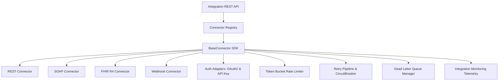

# Enterprise Integration Platform Manual

This document details the production-ready, domain-agnostic **Enterprise Integration Platform**.

> [!IMPORTANT]
> **Connector SDK Architecture**:
> **EVERY integration connector MUST inherit from `BaseConnector`**.
> Framework only — zero hardcoded hospital, clinic, or medical facility integrations.

---

## 🏛️ System Topology & SDK Architecture



---

## ⚡ Core Platform Components

1. **Connector SDK (`BaseConnector`)** ([`base_connector.py`](file:///home/aryan/Videos/IRE/backend/app/integration/base_connector.py))
   - Standard interface for all enterprise connectors (`connect()`, `authenticate()`, `send()`, `receive()`, `health_check()`, `disconnect()`).
   - Standardized `IntegrationMessage` and `IntegrationResponse` dataclasses.

2. **Connector Registry (`isinstance(BaseConnector)` Enforcement)** ([`registry.py`](file:///home/aryan/Videos/IRE/backend/app/integration/registry.py))
   - Central registry enforcing strict inheritance rule: **All registered connectors MUST inherit from `BaseConnector`**.

3. **Protocol Connectors** ([`connectors.py`](file:///home/aryan/Videos/IRE/backend/app/integration/connectors.py))
   - `RESTConnector`: Generic REST HTTP connector (GET, POST, PUT, DELETE).
   - `SOAPConnector`: Generic SOAP WS XML connector with envelope generation and `SOAPAction` header.
   - `FHIRConnector`: Generic HL7 FHIR R4 API connector supporting RESTful FHIR resources & bundles without hardcoded hospital instances.
   - `WebhookConnector`: Inbound & outbound Webhook connector featuring HMAC SHA-256 signature generation and verification.

4. **Authentication Adapters** ([`auth_adapters.py`](file:///home/aryan/Videos/IRE/backend/app/integration/auth_adapters.py))
   - `OAuth2Authenticator`: Client credentials grant exchange, token caching, token auto-refresh before expiration, and Bearer token header injection.
   - `APIKeyAuthenticator`: Header (`X-API-Key`), query parameter, or Bearer key injector.

5. **Dead Letter Queue (DLQ)** ([`dlq.py`](file:///home/aryan/Videos/IRE/backend/app/integration/dlq.py))
   - Stores failed integration messages after retry exhaustion. Provides message inspection, purging, and retry replay (`replay()`).

6. **Monitoring & Health Telemetry** ([`monitoring.py`](file:///home/aryan/Videos/IRE/backend/app/integration/monitoring.py))
   - Telemetry tracker monitoring total sent, received, error count, moving average latency, and connector health status (`HEALTHY`, `DEGRADED`, `UNHEALTHY`).

---

## 🔌 API Endpoints Summary

| Endpoint | Method | Description |
| :--- | :--- | :--- |
| `/api/v1/integration/connectors/register` | `POST` | Register a new integration connector |
| `/api/v1/integration/connectors` | `GET` | List active connectors and connection status |
| `/api/v1/integration/send` | `POST` | Dispatch integration message via connector |
| `/api/v1/integration/dlq` | `GET` | List dead-lettered failed messages by tenant |
| `/api/v1/integration/dlq/{dlq_id}/replay` | `POST` | Replay failed message from DLQ |
| `/api/v1/integration/dlq/{dlq_id}` | `DELETE` | Remove message from DLQ |
| `/api/v1/integration/monitoring/{connector_id}` | `GET` | Retrieve connector health & latency telemetry |

---

## 🧪 Verification & Unit Testing

```bash
cd /home/aryan/Videos/IRE/backend
python3 -m pytest tests/test_enterprise_integration_platform.py -v
```
