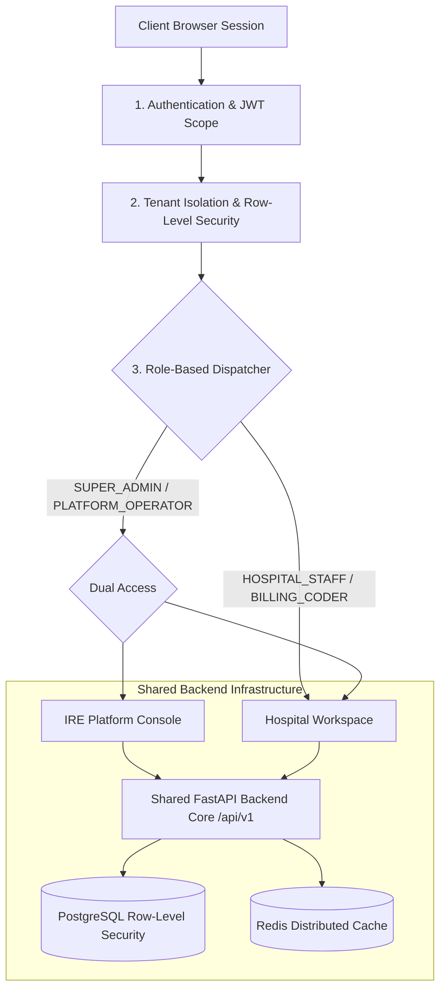

# Role-Based Architecture & System Topology Manual

This document details the refactored **Role-Based Product Architecture** and security boundaries.

---

## 🏛️ System Architecture Topology

---

## 🔒 Security & Role Isolation Matrix

| User Role | Hospital Workspace | Platform Console | App Switcher Button | RLS Data Scope |
| :--- | :---: | :---: | :---: | :--- |
| **`HOSPITAL_STAFF`** | ✅ Accessible | ❌ **Hidden / Blocked** | ❌ **Hidden** | Single Hospital Facility (`Metro General`) |
| **`BILLING_CODER`** | ✅ Accessible | ❌ **Hidden / Blocked** | ❌ **Hidden** | Single Hospital Facility (`Metro General`) |
| **`CHIEF_MEDICAL_OFFICER`**| ✅ Accessible | ❌ **Hidden / Blocked** | ❌ **Hidden** | Single Hospital Facility (`Metro General`) |
| **`SUPER_ADMIN`** | ✅ Accessible | ✅ Accessible | ✅ Visible | Multi-Tenant (All 148 Hospitals) |
| **`PLATFORM_OPERATOR`** | ✅ Accessible | ✅ Accessible | ✅ Visible | Multi-Tenant (All 148 Hospitals) |

> [!IMPORTANT]
> **Hospital User Isolation**: Hospital users (coders, staff, nurses, physicians) are strictly constrained to their single hospital facility via Row-Level Security (RLS). They are completely unaware that the internal Platform Console exists.

---

## 🔌 Shared Backend API Integration

Both applications consume the exact same underlying FastAPI microservice endpoints on `http://localhost:8000`:

- `POST /api/v1/auth/token` — Bearer JWT authentication & role extraction.
- `GET /api/v1/hospitals/` — Facility directory & metadata.
- `POST /api/v1/ocr/process` — Modular OCR extraction engine.
- `POST /api/v1/sdk/plugins/discover` — Founder A SDK plugin discovery.
- `GET /api/v1/healthz` — System health check.

---

## 🌐 Live Gateway Access

Access the authentication gateway live:
- Open [http://localhost:8080/](http://localhost:8080/)
