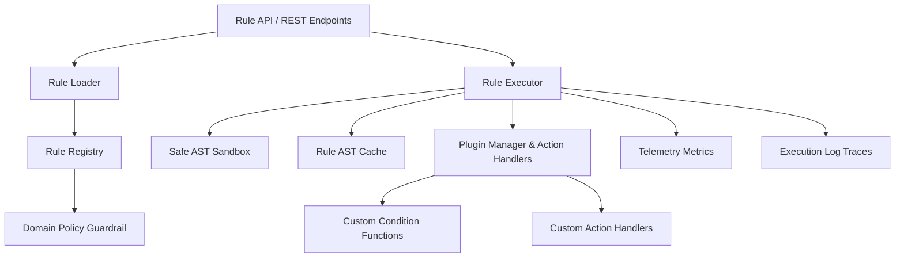

# Production-Grade Rule Engine Framework Manual

This document details the production-ready, domain-agnostic **Rule Engine Framework**.

> [!IMPORTANT]
> **Strict Domain Constraint**:
> The infrastructure contains **ZERO hardcoded insurance rules**. All rules are declarative and defined externally via JSON/YAML payloads or dynamic plugins. All rule inputs are automatically screened by `DomainGuardrail` to prohibit insurance domain rules.

---

## 🏛️ System Architecture



---

## ⚡ Core Engine Capabilities

1. **Rule Registry** ([`registry.py`](file:///home/aryan/Videos/IRE/backend/app/rules/registry.py))
   - Group-aware, versioned rule store (`DeclarativeRule`).
   - Domain Guardrail validation rejecting insurance domain content.

2. **Rule Loader** ([`loader.py`](file:///home/aryan/Videos/IRE/backend/app/rules/loader.py))
   - Dynamic JSON string, dictionary, and file loading without requiring backend code changes or deployments.

3. **Rule Executor** ([`executor.py`](file:///home/aryan/Videos/IRE/backend/app/rules/executor.py))
   - Evaluates rule condition ASTs safely.
   - Priority (salience) sorting: higher priority rules are evaluated first.
   - Prerequisite dependency resolution.
   - Action dispatching upon rule trigger.
   - Interpolates context payload variables into template explanations and suggestions.

4. **Rule Sandbox** ([`sandbox.py`](file:///home/aryan/Videos/IRE/backend/app/rules/sandbox.py))
   - Secure AST node whitelist enforcing safe execution.
   - Protects against introspection (`__subclasses__`), imports (`os`, `sys`), and dangerous function calls.

5. **Rule Plugins & Extension Points** ([`plugins.py`](file:///home/aryan/Videos/IRE/backend/app/rules/plugins.py))
   - `IRulePlugin`: Interface for registering custom condition functions (e.g. `regex_match`, `date_diff_days`).
   - `IRuleActionHandler`: Interface for custom action dispatching (e.g. `log_alert`, `set_field`, `webhook`).

6. **Rule Caching** ([`caching.py`](file:///home/aryan/Videos/IRE/backend/app/rules/caching.py))
   - In-Memory / Redis AST compilation caching avoiding re-parsing overhead.

7. **Rule Testing Suite** ([`testing.py`](file:///home/aryan/Videos/IRE/backend/app/rules/testing.py))
   - Automated testing harness for evaluating rule conditions against mock payloads before deployment.

8. **Rule Metrics & Logs** ([`metrics.py`](file:///home/aryan/Videos/IRE/backend/app/rules/metrics.py))
   - Execution counters, rule trigger frequency, critical alert statistics, and step-by-step `RuleEvaluationTrace` audit logs.

---

## 🔌 API Endpoints Summary

| Endpoint | Method | Description |
| :--- | :--- | :--- |
| `/api/v1/rules/execute` | `POST` | Execute declarative rules for payload & group |
| `/api/v1/rules/register` | `POST` | Register a new declarative rule |
| `/api/v1/rules/` | `GET` | List rules (filter by group, tag, active state) |
| `/api/v1/rules/groups` | `GET` | List all registered rule groups |
| `/api/v1/rules/load` | `POST` | Batch load rules from JSON payload |
| `/api/v1/rules/test` | `POST` | Run rule test suite with mock payloads |
| `/api/v1/rules/metrics` | `GET` | Retrieve engine execution metrics & cache stats |
| `/api/v1/rules/cache/clear` | `POST` | Purge compiled AST rule cache |

---

## 🧪 Verification & Unit Testing

```bash
cd /home/aryan/Videos/IRE/backend
python3 -m pytest tests/test_rule_engine_framework.py -v
```
